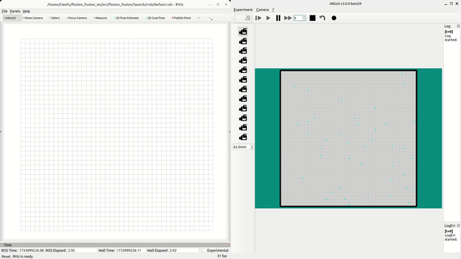

# fission_fusion
Fission–fusion societies, observed in various animal species, are characterized by dynamic changes in group size and composition as individuals merge (fusion) or split (fission) in response to environmental and social factors. This dynamic structuring provides a framework for exploring adaptive behaviors and collective decision-making. 


# Start up

## Launch simulation environment

```bash
export LD_LIBRARY_PATH=$LD_LIBRARY_PATH:/usr/local/lib/argos3:/YOUR_WORKSPACE/PATH/src/fission_fusion/lib
export ARGOS_PLUGIN_PATH=/YOUR_WORKSPACE/PATH/src/fission_fusion/lib
argos3 -c /experiments/fission_fusion.argos
```

## Launch controller node
```bash
source install/setup.bash
ros2 launch fission_fusion run.launch.py
```

## Launch manual test robot
```bash
ros2 run teleop_twist_keyboard teleop_twist_keyboard --ros-args -r cmd_vel:=bot0/cmd_vel
```


## Demo of SDRM

